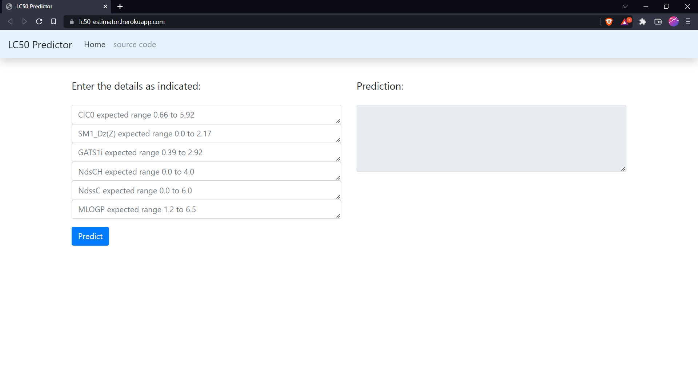

# Prediction of LC50 value QSAR models

Dataset: https://archive.ics.uci.edu/ml/datasets/QSAR+fish+toxicity 

# Problem Statement 

Prediction of LC50 value using Quantitative structure activity relationship models ( QSAR models ).
Develop quantitative regression QSAR models to predict acute aquatic toxicity towards the fish fathead minnow ( Pimephales promelas ) on a set of 908 chemicals based on 6 molecular descriptors.


# Dataset description

LC50 data, which is the concentration that causes death in 50% of test fish over a test duration of 96 hours, was used as model response. The model comprised 6 molecular descriptors: MLOGP (molecular properties), CIC0 (information indices), GATS1i (2D autocorrelations), NdssC (atom-type counts), NdsCH ((atom-type counts), SM1_Dz(Z) (2D matrix-based descriptors). 

# Regressor Models used: 

Multiple Linear Regression

XGBoost Regressor

Support Vector Machine Regressor

Random Forest Regressor

Artificial Neural Network   

# To run this Project locally

Step 1: Create conda environment

```
conda create -n env_name python=3.7 -y

```

Step 2:  clone the repo 

```
git clone https://github.com/sarikamohan08/LC50-QSAR-estimator.git

```

step 3 :install the requirements

```
pip install -r requirements.txt

```

step 4 : run the app.py file

```
python app.py

```

# Input console 



